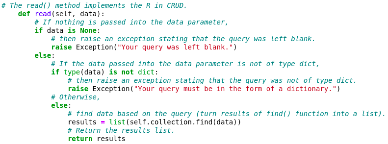

# K9Recruit

K9Recruit facilitates the process of identifying the best
canine candidates for search-and-rescue training.  This powerful 
software package facilitates the CRUD (create, read, update, delete)
functionality built-in to MongoDB through simple queries which allow 
users to easily navigate and manipulate MongoDB databases. 

## Motivation

International rescue-animal training company Grazioso Salvare has 
asked us to develop  this middleware package to help them navigate 
the databases of their non-profit partners for the best possible 
canine candidates for search-and-rescue training. 

## Getting Started 

### **1)** Import your database file 

Import your data file into MongoDB (if it has not already been imported).  


### **2)** Add the CRUD.py file 

Add the CRUD.py file to your directory of choice.  


### **3)** Open the MongoDB shell

Open mongosh by entering the mongosh command into your terminal as depicted below:

```bash
mongosh
```

### **4)** Set your connection variables

Make sure that your connection variables (labeled toward the top of the CRUD.py document) are correct including your username (USER), password (PASS), host address (HOST), port number (PORT), database (DB), and collection (COL).

If you are unsure of the appropriate host and port to use,
this information will appear after you have opened the mongosh shell,
as depicted below: 


If this information does not match what is in your CRUD.py file, 
you will get an error.  


### **5)** Implement your commands

Create a new document or notebook and import AnimalShelter as shown 
below:

```python
from CRUD import AnimalShelter
```

Follow this with the commands which you would like to use to perform CRUD operations on your database.  For specification on how to perform these operations, see the **Usage** section below.


## Installation

Install the latest versions of **Python** and **MongoDB**.

Instructions can be found at the following links:

### Install MongoDB on Linux: 

https://www.mongodb.com/docs/manual/administration/install-on-linux/

### Install MongoBD on Windows

https://www.mongodb.com/docs/manual/tutorial/install-mongodb-on-windows/

### Install MongoDB on Mac:

https://www.mongodb.com/docs/manual/tutorial/install-mongodb-on-os-x/

### Install Python on Linux:

https://www.geeksforgeeks.org/how-to-install-python-on-linux/ 

### Install Python on Windows: 

https://www.python.org/downloads/

### Install Python on Mac: 

https://www.python.org/downloads/macos/ 


## Usage

In order to use this project to interact with MongoDB databases, use the create(), read(), update() and delete() functions to create, delete, and update objects and to query the database. 

### Code Examples

The code snippet below shows the create() method.  As you can see, what is passed into the ‘data’ parameter is used to create animal objects: 


The code in the create() function validates input to make sure that only data of type dictionary (dict) is able to be entered successfully.  This mitigates the possibility of incorrectly formed dictionaries being written to the database, which could result in problems with CRUD operations to the corresponding files.  All of our functions implement input validation of this type.

The code snippet below shows the create() method.  What is passed into the ‘data’ parameter is used to find animal objects within the database: 



The code in the read() function calls MongoDB's find() method to find each animal object which meets the criteria specified in the query, then outputs each animl object within the database.  Since the find() method returns a pointer rather than a list of objects, the read() function turns the elements into items with in a list to facilitate data navigation.

The code snippet below shows the update() function: 


The code in the update() function determines how many files were returned, and uses either update_one() or update_many() as appropriate for the situation.  The number of files which were modified is then printed to the screen.

The code snippet below shows the delete() function:


The code in the delete() function uses the same logic as does the update() function to confirm the number of returned files in order to determine whether the delete_one() or delete_many() methods should be used to delete files.  The number of files which were deleted is then printed to the screen.

### Tests

**In order to use our create() function**, let's add a dragon to our database with the following code:


Now we'll add some more dragons to our database in order to properly showcase our read(), update(), and delete() functions: 


**In order to use our read() function**, let's query our database for all of our dragons with the following code: 


Now let's adjust our query so that only dragons of the fire drake breed show up on our results: 


**In order to use our update() function**, let's make some changes to the files in our database.

First we'll change the breed of our dragon Smaug from "Fire Drake" to "Cold Drake" using both the "animal_type" and "name" specifications in case there is another animal in our database named Smaug:


And let's use our read() function to confirm the changes: 


Success!  Smaug has been changed from a Fire Drake to a Cold Drake (may Tolkien forgive us).

**In order to use our delete() function**, let's delete Smaug from our database with the following code:


Now let's make sure that our deletion was successful. 


Success! 

Now, since dragons do not exist in the real world, let's delete all of the dragons from our database with the code below:


And let's check to make sure that our deletions were successful:


Success!  All dragons have been deleted so that we can focus on finding the best canine candidates for search-and-rescue training.

## Common Problems and Solutions

### Authentication Errors

Always make sure that your user has the appropriate privileges to avoid authentication errors.

Enter your mongosh shell and confirm that your user has readWrite privilege in the database which you will be using by entering the following command as depicted below: 


You should see output similar to the following:


In our example, the username is ‘aacuser’ and ‘AAC’ is the name of our database (db) of choice. 

If your user's roles do not include the correct permission(‘readWrite’) and database name, change the user’s permissions and authorization or create a new user with the appropriate permissions and authorization for use in the database in which you would like to perform CRUD operations with this library.

### ServerSelectionTimeoutError

**Always make sure that your connection variables are assigned the correct values** including your username (USER), password (PASS), host address (HOST), port number (PORT), database (DB), and collection (COL).

If you are unsure of the appropriate host and port to use, open mongosh in your terminal and look for the “Connect to:” section toward the top of the output.  The host and port number for this example are shown in the image below. 


The values circled in red above should be assigned as the values of the variables circled in red as depicted below:


Your host and port will almost certainly be different than those in the example, so be sure to add the appropriate host and port as the values of your HOST and PORT variables.  

## Roadmap

We are currently working on a front-end to which this middleware can be connected between the front-end and the MongoDB database.  We are also working on adding functions to change connection variables, add and remove users, and edit user privileges within the application rather than having to edit the CRUD.py file or go through the MongoDB shell.  Follow us on social media and visit our GitHub to see if any new versions or functions have been added to the project.

**Contact:**
Emilio DiStefano 
